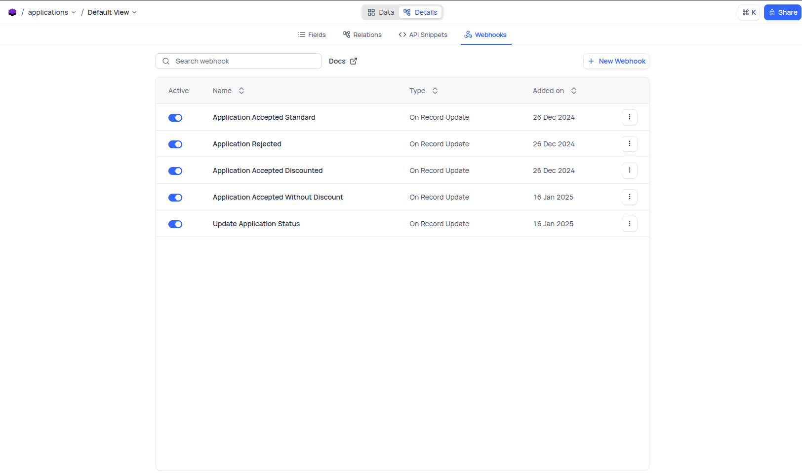
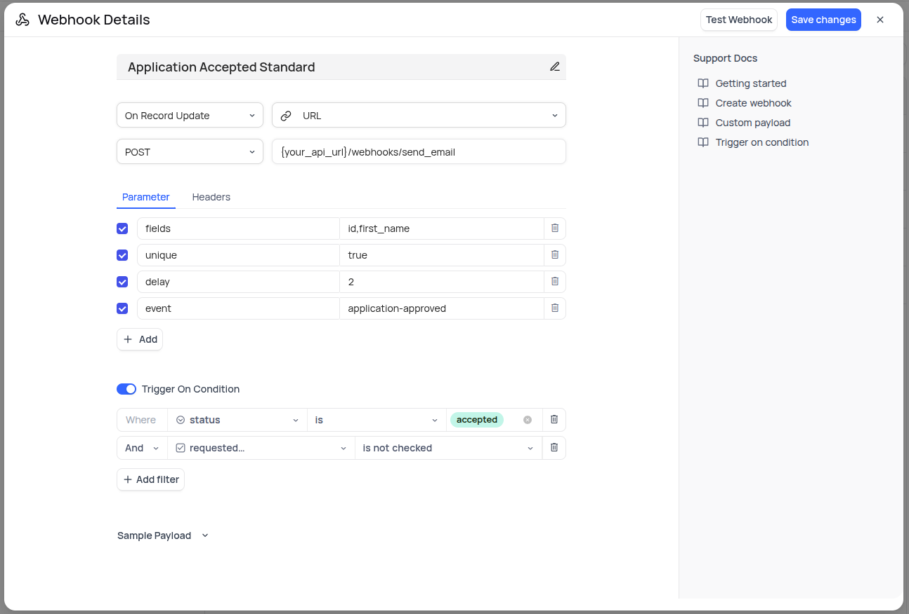
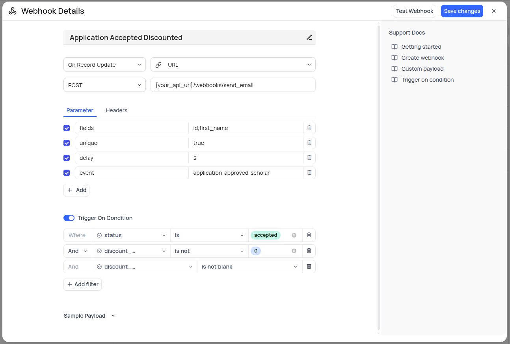
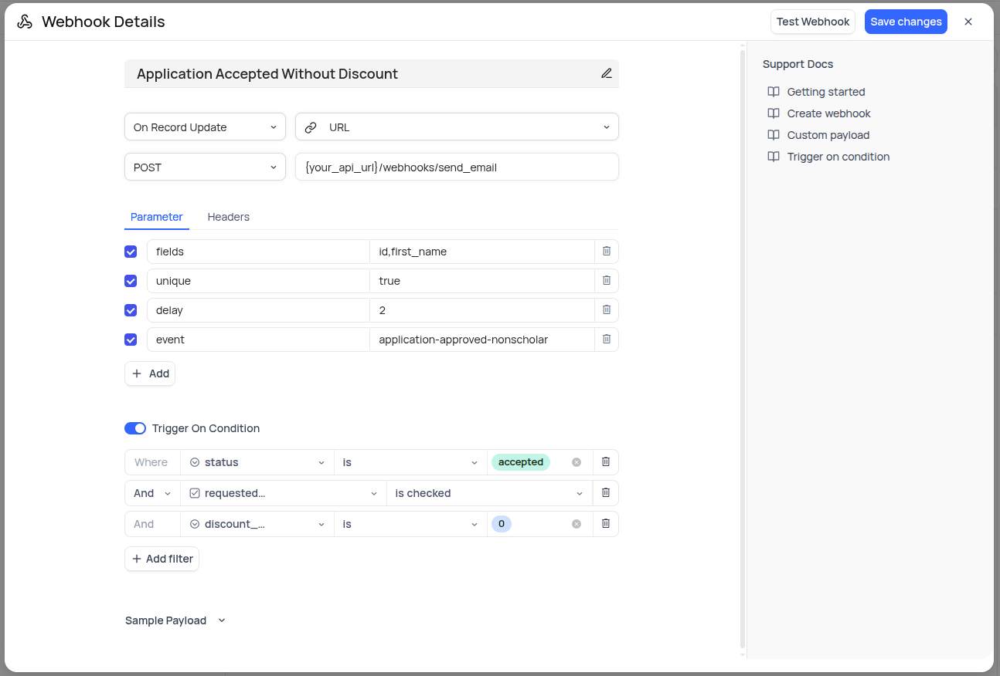
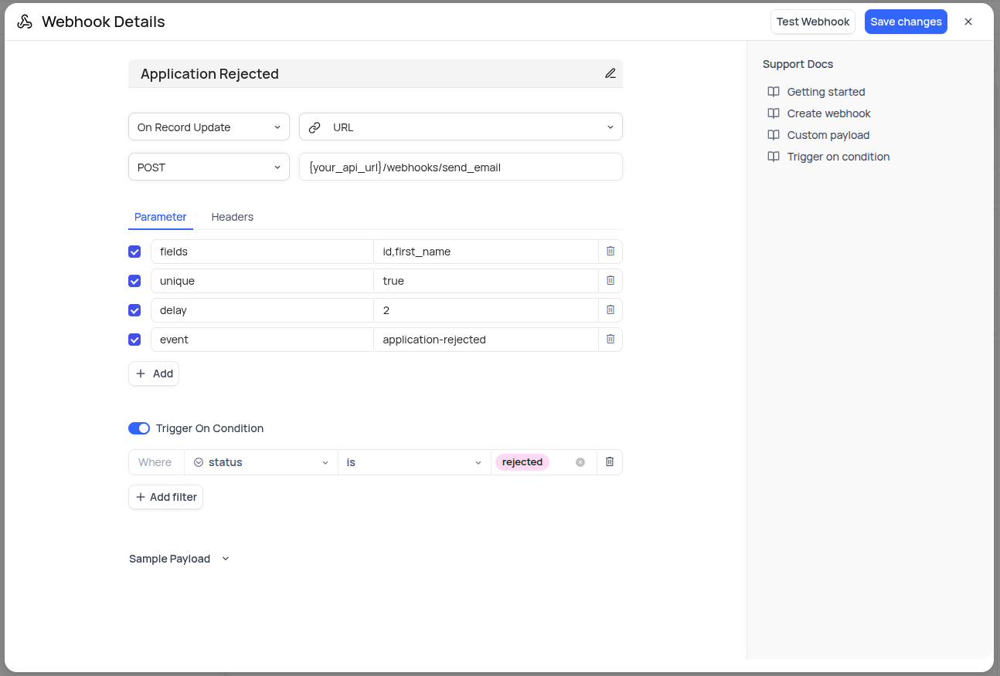
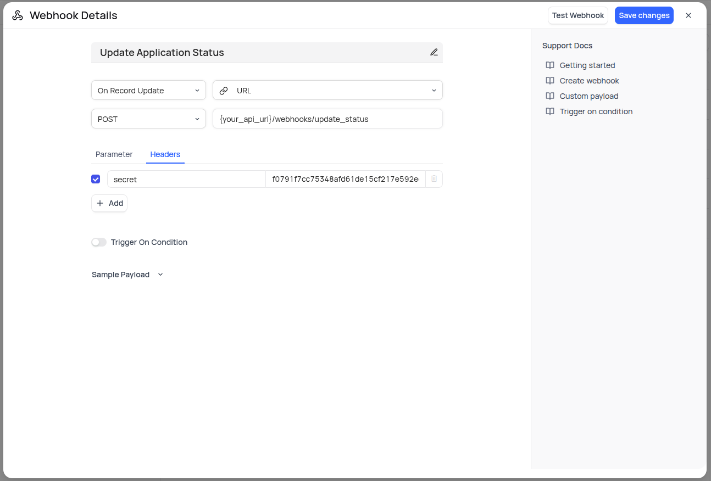

# NocoDB Webhooks Configuration

## Overview

NocoDB webhooks enable automatic notifications to the Citizen Portal API when specific events occur in the database. These webhooks are essential for triggering emails and other actions based on application status changes.

## Available Webhooks

The following webhooks should be configured in your NocoDB instance:

* **Application Accepted Standard**: Sends confirmation email when an application is approved with standard pricing
* **Application Rejected**: Sends notification when an application is rejected
* **Application Accepted Discounted**: Sends confirmation email when an application is approved with discounted pricing
* **Application Accepted Without Discount**: Sends confirmation email when an application is approved without any discount
* **Update Application Status**: Handles general status change notifications

All of these are triggered by the event type `On Record Update`.

## Webhook Configuration Steps

### 1. Access Webhooks in NocoDB

Navigate to the **Webhooks** tab in your NocoDB interface.

### 2. Create a New Webhook

Click on the **New Webhook** button.

### 3. Configure Common Settings

For each webhook, apply the following base configuration:

* **Event Type**: `On Record Update`
* **HTTP Method**: `POST`
* **URL**: `{your_api_url}/webhooks/send_email`
* **Unique**: `true`
* **Delay**: `2`
* **Fields**: `id,first_name` *(add `status` if needed)*

### 4. Configure Each Webhook

Below are the specific details for each webhook:

#### Application Accepted Standard

Sends an email when an application that did not request a discount is accepted.

#### Application Accepted Discounted

Sends an email when an application that requested a discount is accepted and the discount is granted.

#### Application Accepted Without Discount

Sends an email when an application that requested a discount is accepted without receiving the discount.

#### Application Rejected

Updates the status of an application. This is the only webhook that requires a custom header.

#### Update Application Status

Updates the status of an application. This is the only webhook that requires a custom header.
For details on how status values are determined, see the [Status Calculation Logic](./status_calculation.md).

---

**← [Back to Documentation Index](./index.md)**
